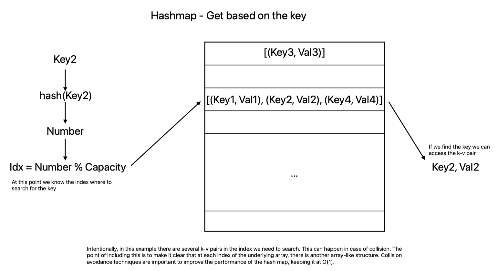

# Array and Hashmaps

In this post, we are going to go from zero to one in arrays and hashmaps. Whether you are new to the concepts or have some familiarity with them, we'll cover them in a practical way, with examples that illustrate the advantages and disadvantages of using either data structure in a given scenario.

I did not write this post expecting coding proficiency from the reader, but some programming background is useful to understand the examples at a deeper level. I'll be using TypeScript on the examples as it's one of the easiest languages out there. If you are not familiar with it, don't be discouraged, I'll also provide graphical content that will help you understand what's going on.

The post you are about to read has two main parts. In the first part, we'll start by understanding the Array data structure, learn how to work with arrays, and understand its performance implications. Then, in the second part, we will introduce the hashmap as a new data structure that can eliminate some of these shortcomings.

## Arrays

Arrays are one of the simplest data structures. An example of an array is a string, which is no more than an ordered sequence of characters. Before going into the practical application of an array, it's important to understand the underlying structure, so we understand its restrictions.

Data is stored in bytes. And the memory of the device your code runs on could be represented in such a grid that each square represents one byte.

! grid image

When we instantiate an array what we are doing is reserving several consecutive slots where we will put our data. That memory is now allocated to your array. If you want to use it for something else, you will have to free it if you are using a language that requires you to manage memory, however, there are many languages that manage it for use via different mechanisms, just like JavaScript/TypeScript.

### Indexing, sizing, and typing

What else? We have the memory, but the information our code needs to have about the array is, the starting point, how many items you want to store, and what's the type of the data.

Why the type of data? Okay, it's easy to understand that we need the starting point and the number of bytes... A good thing about arrays is that you can store any data type in them, however, some data types occupy different memory sizes. Then the only way to know how big is the step to the next element is to know the size of the data type you want to store in the array.

For this reason an array:
- has fixed size
- all stored values have the same type
- each value can be accessed instantly by an index

Depending on the programming language you are using you can have different kinds of indexing:
- 0-based indexing - the first value has index 0
- 1-based indexing - the first value has index 1
- n-based indexing - the index of the first element is arbitrary

Note: All the examples in this post will be in TypeScript, which is a wrapper over JavaScript with type checking and type features, and JavaScript is a 0-based indexed language.
Another peculiarity about JavaScript is that when we instantiate an array `let arr = [];`, `arr` is not purely an array. It has other properties like automatic sizing that are not innate in arrays. What it was in common with an array, is that values are indexed consecutively, all values must have the same type and we can transverse it like an array. 

After this more nuanced introduction, we are ready to start talking about arrays.

### Operations in an array

#### Insertion
Insertion means inserting a new value without deleting any of the previous values. This means that if there is already a value at the index we want to insert we will need to shift all the following values. Take the example array below:


If we want to insert 9 at index 2. It's fairly simple:

However, if we want to insert 1 at index 0, that index already has a value so we need to replace all the other elements of the array by one.

There is also the issue of, what happens if the array is full? That depends on how you want to implement that operation, depending on your problem. If you are building a cache, for example, you would just discard the elements once their new index is out of capacity. If not, you would have to resize your array. Resizing consists of creating a new and bigger array and copying each value of your previous array into it.

This is an operation with a time complexity of O(n), as in the worst-case scenario you would need to shift the n elements of the array, one by one.

#### Updating

Updating a value based on its index is a very fast operation with O(1) complexity. All you need to do is go to the index and update it.

```ts
let arr: number[] = [1, 3, 6, 9];

// updating index 2 to the value 5
arr[2] = 5;

// [1, 3, 5, 9]
```

#### Searching

Arrays are very fast when we know exactly at which index we have to perform our operation. However, when we don't know at which index our value is we have to perform a search.

An example of a scenario where you want to perform a search is when you want to check if a given value is in the array.

```ts
function searchValue(arr: number[], needle: number): number {
  for (let i = 0; i < arr.length; i++) {
    if (arr[i] === needle) {
      return i;
    }
  }
  return -1;
}
```
This is a very common search algorithm known as **Linear Search** in an unsorted array. We walk through all elements of the array, and when we find one that matches our needle, we return its index. If it's not there, we won't ever find it and return -1. Again, time complexity of O(n).

### Sorting an array

Searching in an array could be much faster if only the array was sorted. **Binary Search** is a great way of finding our value. 

#### Binary search


```ts
/**
 * Performs binary search on a sorted array to find the index of a given element.
 * If the element is not found, returns -1.
 *
 * @param {number[]} arr - The sorted array to search in.
 * @param {number} needle - The element to search for.
 * @returns {number} - The index of the element in the array, or -1 if not found.
 */
function bs(arr: number[], needle: number): number {
  // 1st edge case
  // array has size 0
  if (arr.length === 0) {
      return -1;
  }

  // 2nd edge case
  // array has size 1
  // either the only element is or isn't the needle
  if (arr.length === 1) {
      if (arr[0] === needle) {
          return 0;
      }
      return -1;
  }

  // creating the initial search boundary
  let hi = arr.length -1;
  let lo = 0;
  
  while (hi >= lo) {
    // calculating the mid point
    // it's important to offset the value of lo
    const mid = lo + Math.floor((hi - lo) / 2);

    // in case the mid point is the needle
    if (arr[mid] === needle) {
        return mid;
    }

    // if value at mid is larger
    // adjust boundary to search the left
    if (arr[mid] > needle) {
        hi = mid - 1;
    }
    // if value at mid is smaller
    // adjust boundary to search the right
    if (arr[mid] < needle) {
        lo = mid + 1;
    }
  }

  // after boundaries being "inversed"
  // it's not in the array
  return -1;    

}
```

Let's evaluate the time complexity of thios algorithm.


Finding a value with binary search has O(logN) complexity. The key thing is having a sorted array. Below are some widely used techniques to sort an array:
- Bubble sort
- Merge sort
- Quick sort


### Performance

To summarize, in an array, we can access and update a value at a given index at instant time. However, when searching for a value, we would have to walk all elements until we find it or reach the end of the array, which means O(n).

### Leetcode example

In order to drop a clear example of how arrays can be used, we will solve leetcode problem **#217 - Contains Duplicate** (add link). This problem says: Given an integer array nums, return `true` if any value appears at least twice in the array, and return `false` if every element is distinct.

Using arrays to solve this problem, the solution doesn't look that hard. We need to walk through an array, and at each index, walk again the array from 0 to that index checking is that value didn't show up before. It would look something like this:

```ts
function containsDuplicate(nums: number[]): boolean {
    const seen: number[] = [];
    for (let i = 0; i < nums.length; i++) {
        for (let j = 0; j < nums.length; j++) {
            if (nums[i] === seen[j]) {
                return true;
            }
        }
        seen.push(nums[i]);
    }
    return false;
};
```

### Limitations

This solution has a time complexity of O(n^2). Eventhough it solves the problem, when I submited it in leetcode it wasn't accepted, because it exceeded the time limit.

Let's take a look at the bench mark for this problem on leetcode and see how efficient this algorithm is in comparison with the submissions from others:


Even passing 65 out of 75 tests, it isn't good enough. I also tried extracting the duplicate check to a separate method, which spead up enough to get the tests to pass. However, the Big O is the same.

```ts
function containsDuplicate(nums: number[]): boolean {
    const seen: number[] = []
    for (let i = 0; i < nums.length; i++) {
        if (duplicate(seen, nums[i])) {
            return true;
        }
        seen.push(nums[i]);    
    }
    return false;
};

function duplicate(seen: number[], num: number): boolean {
    for (let i = 0; i < seen.length; i++) {
        if (num === seen[i]) {
            return true;
        }
    }
    return false;
}
```


#### How could we be more efficient? 

We need a fundamentally different approach. Arrays are a great programming construct, but there are other data structures that overcome some of its limitations. 

In this case we solved the problem, with a time complexity of O(n^2) as we needed to iterate twice. How much could it be improved using **hashmaps**?

## Hashmaps

In an array, you can access a value through its index in constant time, meaning O(1). Hashmaps are similar in that regard. The basic distinctions are that intead of index, we call it key, and this key, which is unique, can be anything, not just sequential integers representing the position. This allows us to query information in a fundamentally differnt way.

So what is an Hashmap? It's fundamentally an array whose each element is another array, or list, of key-value pairs.

### Hashing

The logic question to ask at this point is, how can we have instant access to each key-value pair, without knowing it's index in the underlying array?

The answer boils down to a single word: **Hash Function**

A hash funtion is a funtion, that takes in our key, and spits out a number. This returned number must be unique to our key, and consistent, so whenever we introduce the same key we get the same number.

What to do with this number?
Our fundamental underlying array, has a fixed size, which is the **capacity**. So if we do the operation `hashedKey % capacity` we get the index were to put our key value pair, and it will always be at that index. This is what allows us to get to our value in constant time.

Note:
In this post I'm not covering colision and how they are solved. Collisions happen when the different keys need to be stored at the same index. They both can exist in the same index, but it's important to understand that this might have impact on performance. Collisions can be reduced by incresing capacity (which uses more memory), and using a proper hash function, that has a uniform distribution.

### Operations in a hashmap

In a hashmap we can check if it **has a key**, **get the value** based on the key and **delete a k-v pair**. All these operations have a O(1). We can also **iterate** through all k-v pairs, which obviously uses O(n).

#### Inserting


#### Retrieving



### Leetcode example

Let's solve the same exercise (**#217 - Contains Duplicate**), with one more tool in our kit. We will not need to implement it, as Javascript provides a `Map` implementantion out of the box, as well as a `Set` (which prevents duplicated keys).

- Have a hashmap to store the values of the array as key (the value could be anything, like the count of that value in the array. It is not needed for this case)

- Walk through the given array and do this:
  
  if the value the hashmap has the key, **return true**
  else, **add to hashmap**

- Case we run through the whole array without finding repetiotions, **return false**

```ts
function containsDuplicate(nums: number[]): boolean {
    const numset: Set<number> = new Set<number>();
    for (let i = 0; i < nums.length; i++) {
        const size = numset.size;
        numset.add(nums[i]);
        if (size === numset.size) {
            return true;
        }
    }
    return false;
};
```

Using the `Set` we can simply compare the siz before and after adding a new number, and if the size is the same we know it's a duplicate.

The time complexity of this solution is O(n), much faster than the array only solution.


It's evident how much performant it can be using a **hasmap**.

## Key takeaways

Arrays are very useful structures to store data, but in some situations if becomes very slow to work with that data. If we need to search for a value, not knowing it's index, the best way it to use a hashmap.

Searching for a value in an **Array** takes O(N), while in a **Hasmap** takes O(1).


